#PyGauss Project Page

**Documentation**: https://pygauss.readthedocs.org

**Conda Distro**: https://binstar.org/cjs14/pygauss

**PyPi Distro**: https://pypi.python.org/pypi/pygauss

PyGauss is intended as an interactive tool for supporting the 
lifecycle of a computational molecular chemistry investigation.
From visual and analytical exploration, 
through to documentation and publication.

Intitally PyGauss has been designed for the purpose of examining one or more
[Gaussian](http://www.gaussian.com/) quantum chemical
computations, both **geometrically** and **electronically**. It is built on top of the
[cclib](http://cclib.github.io/)/[chemview](http://chemview.readthedocs.org/en/latest/)/
[chemlab](http://chemlab.readthedocs.org/en/latest/index.html)
suite of packages and python scientific stack though, and so should be extensible 
to other types of computational chemical analysis. 
PyGauss is primarily designed to be used interactively in the 
[IPython Notebook](http://ipython.org/notebook.html). 

As shown in the examples, a molecular optimisation can be assesed
individually (much like in
[gaussview](http://www.gaussian.com/g_prod/gv5b.htm)), but also as
part of a group. The advantages of this package are then:

-  Faster, more efficient analysis
-  Extensible analysis
-  Reproducible analysis

##Quick Start

###OSX and Linux

The recommended was to use pygauss is to download the [Anaconda](http://continuum.io/downloads) Scientific Python Distribution (64-bit). Once downloaded a new environment can be created in terminal and pygauss installed:

    conda create -n pg_env -c https://conda.binstar.org/cjs14 pygauss

###Windows

There is currently no pygauss Conda distributable for Windows. Please see the documentation for an explanation of how to install on this platform.

##Example Assessment

After installing PyGauss you should be able to open this IPython Notebook from;
https://github.com/chrisjsewell/PyGauss/blob/master/Example_Assessment.ipynb, and run the following...

    from IPython.display import display, Image
    %matplotlib inline
    import pygauss as pg
    print 'pygauss version: {}'.format(pg.__version__)

    pygauss version: 0.5.1
    

The test folder has a number of example Gaussian outputs to play around with.

    folder = pg.get_test_folder()
    len(folder.list_files())

    37

**Note:** the *folder* object will act identical whether using a local path or one on a server over ssh (using [paramiko](http://www.paramiko.org/)):

    folder = pg.Folder('/path/to/folder', 
                    ssh_server='login.server.com',
                    ssh_username='username')

###Single Molecule Analysis

A *molecule* can be created containg data about the inital geometry, optimisation process and analysis of the final configuration.

    mol = pg.molecule.Molecule(folder_obj=folder,
                    init_fname='CJS1_emim-cl_B_init.com', 
                    opt_fname=['CJS1_emim-cl_B_6-311+g-d-p-_gd3bj_opt-modredundant_difrz.log',
                               'CJS1_emim-cl_B_6-311+g-d-p-_gd3bj_opt-modredundant_difrz_err.log',
                               'CJS1_emim-cl_B_6-311+g-d-p-_gd3bj_opt-modredundant_unfrz.log'],
                    freq_fname='CJS1_emim-cl_B_6-311+g-d-p-_gd3bj_freq_unfrz.log',
                    nbo_fname='CJS1_emim-cl_B_6-311+g-d-p-_gd3bj_pop-nbo-full-_unfrz.log', 
                    atom_groups={'emim':range(20), 'cl':[20]},
                    alignto=[3,2,1])

####Geometric Analysis

Molecules can be viewed statically or interactively.

    #mol.show_initial(active=True)
    vdw = mol.show_initial(represent='vdw', rotations=[[0,0,90], [-90, 90, 0]])
    ball_stick = mol.show_optimisation(represent='ball_stick', rotations=[[0,0,90], [-90, 90, 0]])
    display(vdw, ball_stick)

    print 'Cl optimised polar coords from aromatic ring : ({0}, {1},{2})'.format(
        *[round(i, 2) for i in mol.calc_polar_coords_from_plane(20,3,2,1)])
    ax = mol.plot_opt_trajectory(20, [3,2,1])
    ax.set_title('Cl optimisation path')
    ax.get_figure().set_size_inches(4, 3)

    Cl optimised polar coords from aromatic ring : (0.11, -116.42,-170.06)
    

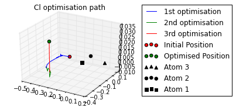

####Energetics and Frequency Analysis

    print('Optimised? {0}, Conformer? {1}, Energy = {2} a.u.'.format(
        mol.is_optimised(), mol.is_conformer(), 
        round(mol.get_opt_energy(units='hartree'),3)))
    ax = mol.plot_opt_energy(units='hartree')
    ax.get_figure().set_size_inches(3, 2)
    ax = mol.plot_freq_analysis()
    ax.get_figure().set_size_inches(4, 2)

    Optimised? True, Conformer? True, Energy = -805.105 a.u.
    

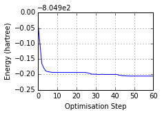

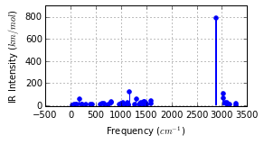

Potential Energy Scan analysis of geometric conformers...

    mol2 = pg.molecule.Molecule(folder_obj=folder, alignto=[3,2,1],
                pes_fname=['CJS_emim_6311_plus_d3_scan.log', 
                           'CJS_emim_6311_plus_d3_scan_bck.log'])   
    ax = mol2.plot_pes_scans([1,4,9,10], rotation=[0,0,90], img_pos='local_maxs', zoom=0.5)
    ax.set_title('Ethyl chain rotational conformer analysis')
    ax.get_figure().set_size_inches(7, 3)

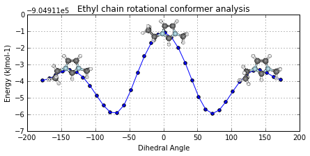

####Partial Charge Analysis

using Natural Bond Orbital (NBO) analysis

    print '+ve charge centre polar coords from aromatic ring: ({0} {1},{2})'.format(
        *[round(i, 2) for i in mol.calc_nbo_charge_center(3, 2, 1)])
    display(mol.show_nbo_charges(represent='ball_stick', axis_length=0.4, 
                                  rotations=[[0,0,90], [-90, 90, 0]]))

    +ve charge centre polar coords from aromatic ring: (0.02 -51.77,-33.15)
    

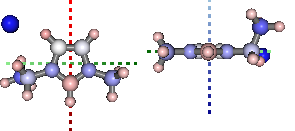

####Density of States Analysis

    print 'Number of Orbitals: {}'.format(mol.get_orbital_count())
    homo, lumo = mol.get_orbital_homo_lumo()
    homoe, lumoe = mol.get_orbital_energies([homo, lumo])
    print 'HOMO at {} eV'.format(homoe)
    print 'LUMO at {} eV'.format(lumoe)

    Number of Orbitals: 272
    HOMO at -4.91492036773 eV
    LUMO at -1.85989816817 eV
    

    ax = mol.plot_dos(per_energy=1,
                    atom_groups=['cl', 'emim'], 
                    group_colors=['blue', 'orange'], 
                    group_labels=['Cl', 'EMIM'], group_fill=False, 
                    lbound=-20, ubound=10, legend_size=12)

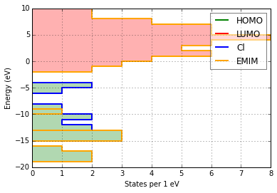

####Bonding Analysis

Using Second Order Perturbation Theory.

    print 'H inter-bond energy = {} kJmol-1'.format(
            mol.calc_hbond_energy(eunits='kJmol-1', atom_groups=['emim', 'cl']))
    print 'Other inter-bond energy = {} kJmol-1'.format(
        mol.calc_sopt_energy(eunits='kJmol-1', no_hbonds=True, atom_groups=['emim', 'cl']))
    display(mol.show_sopt_bonds(min_energy=1, eunits='kJmol-1',
                                atom_groups=['emim', 'cl'],
                                no_hbonds=True,
                                rotations=[[0, 0, 90]]))
    display(mol.show_hbond_analysis(cutoff_energy=5.,alpha=0.6, 
                                    atom_groups=['emim', 'cl'],
                                    rotations=[[0, 0, 90], [90, 0, 0]]))

    H inter-bond energy = 111.7128 kJmol-1
    Other inter-bond energy = 11.00392 kJmol-1
    

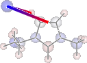

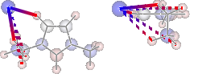

###Multiple Computations Analysis

Multiple computations, for instance of different starting conformations, can be grouped into an *Analysis* class and anlaysed collectively.

    analysis = pg.Analysis(folder_obj=folder)
    errors = analysis.add_runs(headers=['Cation', 'Anion', 'Initial'], 
                                   values=[['emim'], ['cl'],
                                           ['B', 'BE', 'BM', 'F', 'FE']],
                init_pattern='*{0}-{1}_{2}_init.com',
                opt_pattern='*{0}-{1}_{2}_6-311+g-d-p-_gd3bj_opt*unfrz.log',
                freq_pattern='*{0}-{1}_{2}_6-311+g-d-p-_gd3bj_freq*.log',
                nbo_pattern='*{0}-{1}_{2}_6-311+g-d-p-_gd3bj_pop-nbo-full-*.log',
                alignto=[3,2,1], atom_groups={'emim':range(1,20), 'cl':[20]}, 
                ipython_print=True)

    Reading data 5 of 5
    

####Molecular Comparison

    fig, caption = analysis.plot_mol_images(mtype='optimised', max_cols=3,
                            info_columns=['Cation', 'Anion', 'Initial'],
                            rotations=[[0,0,90]])
    print caption

    Figure: (A) emim, cl, B, (B) emim, cl, BE, (C) emim, cl, BM, (D) emim, cl, F, (E) emim, cl, FE
    

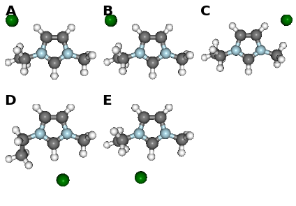

####Data Comparison

    fig, caption = analysis.plot_mol_graphs(gtype='dos', max_cols=3,
                            info_columns=['Cation', 'Anion', 'Initial'],
                            atom_groups=['cl'], group_colors=['blue'], 
                            group_labels=['Cl'], group_fill=True, 
                            lbound=-20, ubound=10, legend_size=8)
    print caption

    Figure: (A) emim, cl, B, (B) emim, cl, BE, (C) emim, cl, BM, (D) emim, cl, F, (E) emim, cl, FE
    

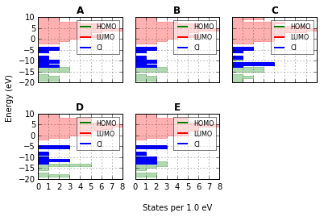

The methods mentioned for indivdiual molecules can be applied to all or a subset of these computations.

    analysis.add_mol_property_subset('Opt', 'is_optimised', rows=[2,3])
    analysis.add_mol_property('Energy (au)', 'get_opt_energy', units='hartree')
    analysis.add_mol_property('Cation chain, $\\psi$', 'calc_dihedral_angle', [1, 4, 9, 10])
    analysis.add_mol_property('Cation Charge', 'calc_nbo_charge', 'emim')
    analysis.add_mol_property('Anion Charge', 'calc_nbo_charge', 'cl')
    analysis.add_mol_property(['Anion-Cation, $r$', 'Anion-Cation, $\\theta$', 'Anion-Cation, $\\phi$'], 
                                   'calc_polar_coords_from_plane', 3, 2, 1, 20)
    analysis.add_mol_property('Anion-Cation h-bond', 'calc_hbond_energy', 
                              eunits='kJmol-1', atom_groups=['emim', 'cl'])
    analysis.get_table(row_index=['Anion', 'Cation', 'Initial'], 
                       column_index=['Cation', 'Anion', 'Anion-Cation'])

<table border="1" class="dataframe">
  <thead>
    <tr>
      <th></th>
      <th></th>
      <th></th>
      <th colspan="2" halign="left"></th>
      <th colspan="2" halign="left">Cation</th>
      <th>Anion</th>
      <th colspan="4" halign="left">Anion-Cation</th>
    </tr>
    <tr>
      <th></th>
      <th></th>
      <th></th>
      <th>Opt</th>
      <th>Energy (au)</th>
      <th>chain, &#968</th>
      <th>Charge</th>
      <th>Charge</th>
      <th>r</th>
      <th>&#952</th>
      <th>&#966</th>
      <th>h-bond</th>
    </tr>
    <tr>
      <th>Anion</th>
      <th>Cation</th>
      <th>Initial</th>
      <th></th>
      <th></th>
      <th></th>
      <th></th>
      <th></th>
      <th></th>
      <th></th>
      <th></th>
      <th></th>
    </tr>
  </thead>
  <tbody>
    <tr>
      <th rowspan="5" valign="top">cl</th>
      <th rowspan="5" valign="top">emim</th>
      <th>B</th>
      <td>NaN</td>
      <td>-805.105</td>
      <td>80.794</td>
      <td>0.888</td>
      <td>-0.888</td>
      <td>0.420</td>
      <td>-123.392</td>
      <td>172.515</td>
      <td>111.713</td>
    </tr>
    <tr>
      <th>BE</th>
      <td>NaN</td>
      <td>-805.105</td>
      <td>80.622</td>
      <td>0.887</td>
      <td>-0.887</td>
      <td>0.420</td>
      <td>-123.449</td>
      <td>172.806</td>
      <td>112.382</td>
    </tr>
    <tr>
      <th>BM</th>
      <td>True</td>
      <td>-805.104</td>
      <td>73.103</td>
      <td>0.874</td>
      <td>-0.874</td>
      <td>0.420</td>
      <td>124.121</td>
      <td>-166.774</td>
      <td>130.624</td>
    </tr>
    <tr>
      <th>F</th>
      <td>True</td>
      <td>-805.118</td>
      <td>147.026</td>
      <td>0.840</td>
      <td>-0.840</td>
      <td>0.420</td>
      <td>10.393</td>
      <td>0.728</td>
      <td>202.004</td>
    </tr>
    <tr>
      <th>FE</th>
      <td>NaN</td>
      <td>-805.117</td>
      <td>85.310</td>
      <td>0.851</td>
      <td>-0.851</td>
      <td>0.417</td>
      <td>-13.254</td>
      <td>-4.873</td>
      <td>177.360</td>
    </tr>
  </tbody>
</table>

There is also an option (requiring [pdflatex](http://www.tug.org/applications/pdftex/) and [ghostscript](http://www.ghostscript.com/download/gsdnld.html)+[imagemagik](http://www.imagemagick.org/script/binary-releases.php)) to output the tables as a latex formatted image.

    analysis.get_table(row_index=['Anion', 'Cation', 'Initial'],
                       column_index=['Cation', 'Anion', 'Anion-Cation'],
                       as_image=True, font_size=12)

####Multi-Variate Analysis

RadViz is a way of visualizing multi-variate data.

    ax = analysis.plot_radviz_comparison('Anion', columns=range(4, 10))

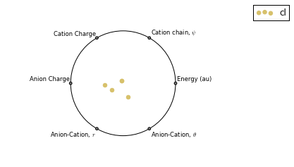

The KMeans algorithm clusters data by trying to separate samples into n groups of equal variance.

    pg.utils.imgplot_kmean_groups(
        analysis, 'Anion', 'cl', 4, range(4, 10), 
        output=['Initial'], mtype='optimised', 
        rotations=[[0, 0, 90], [-90, 90, 0]],
        axis_length=0.3)

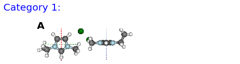

    Figure: (A) BM
    

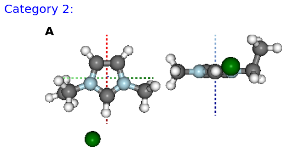

    Figure: (A) FE
    

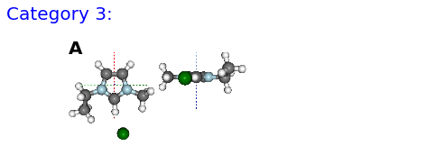

    Figure: (A) B, (B) BE
    

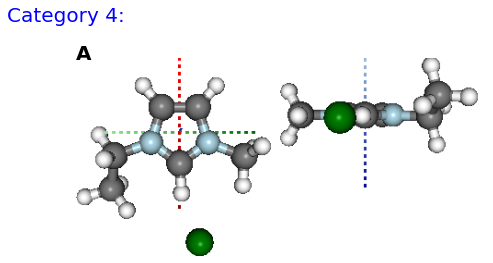

    Figure: (A) F
    

###Documentation (MS Word)

After analysing the computations, it would be reasonable to want to document some of our findings. This can be achieved by outputting individual figure or table images via the folder object.

    file_path = folder.save_ipyimg(vdw, 'image_of_molecule')
    Image(file_path)

But you may also want to produce a more full record of your analysis, and this is where [python-docx](https://python-docx.readthedocs.org) steps in. Building on this package the pygauss MSDocument class can produce a full document of your analysis. 

    import matplotlib.pyplot as plt
    d = pg.MSDocument()
    d.add_heading('A Pygauss Example Assessment', level=0)

    d.add_docstring("""
    # Introduction

    We have looked at the following aspects
    of [EMIM]^{+}[Cl]^{-} (C_{6}H_{11}ClN_{2});

    - Geometric conformers
    - Electronic structure

    # Geometric Conformers
    """)

    fig, caption = analysis.plot_mol_images(max_cols=2, 
                    rotations=[[90,0,0], [0,0,90]], 
                    info_columns=['Anion', 'Cation', 'Initial'])
    d.add_mpl(fig, dpi=96, height=9, caption=caption)
    plt.close()
    d.add_paragraph()
    df = analysis.get_table(
            columns=['Anion Charge', 'Cation Charge'],
            row_index=['Anion', 'Cation', 'Initial'])
    d.add_dataframe(df, incl_indx=True, style='Medium Shading 1 Accent 1',
                    caption='Analysis of Conformer Charge')

    d.add_docstring("""
    # Molecular Orbital Analysis
    ## Density of States

    It is **important** to *emphasise* that the
    computations have only been run in the gas phase.
    """)
    fig, caption = analysis.plot_mol_graphs(gtype='dos', max_cols=3,
                            info_columns=['Cation', 'Anion', 'Initial'],
                            atom_groups=['cl'], group_colors=['blue'], 
                            group_labels=['Cl'], group_fill=True, 
                            lbound=-20, ubound=10, legend_size=8)
    d.add_mpl(fig, dpi=96, height=9, caption=caption)
    plt.close()

    d.save('exmpl_assess.docx')

Which gives us the following:

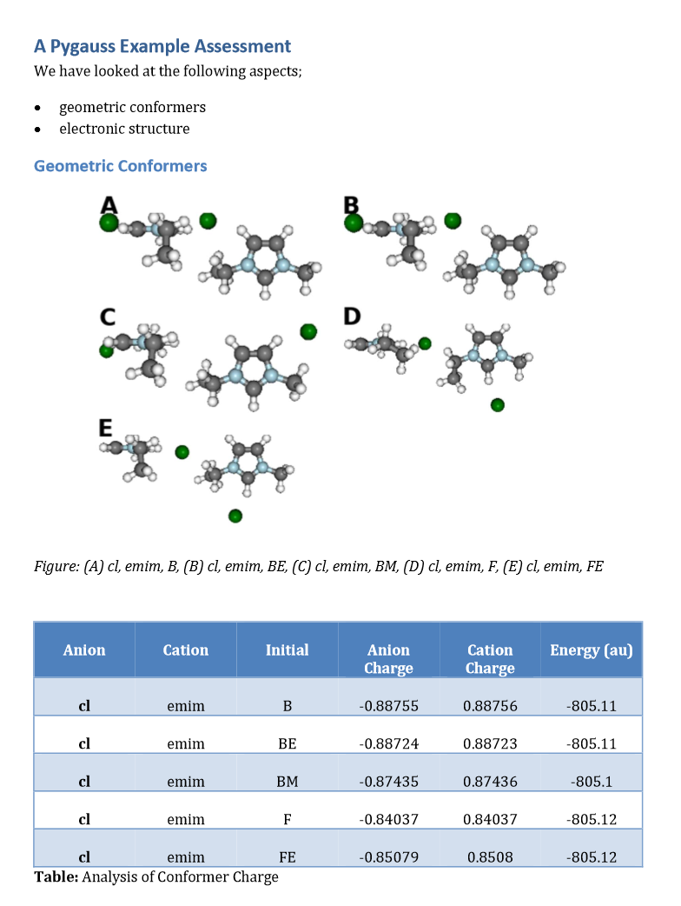
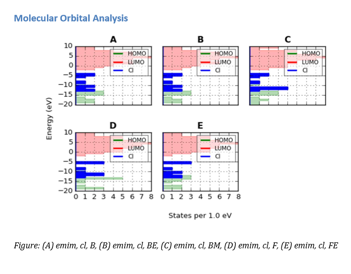

MORE TO COME!!

