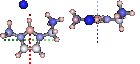

PyGauss
=======

A layer on top of cclib (v1.3), chemlab (v0.4) and pandas (v0.15.2) for analysis of gaussian DFT output

The basic function of the API is to take in data files ouput from
Gaussian for a particular system and analyse their outcome in terms of:

-  Geometry alignment and,
-  Electronic distribution  

Example
-------

.. code:: python

    import pygauss.analysis as pg
    folder = pg.get_test_folder()
    
    analysis = pg.Analysis(folder)
    analysis.add_runs(headers=['Cation', 'Anion', 'Initial'], 
                      values=[['emim'], ['cl'], ['B', 'F']],
        init_pattern='CJS1_{0}-{1}_{2}_init.com',
        opt_pattern='CJS1_{0}-{1}_{2}_6-311+g-d-p-_gd3bj_opt-modredundant_unfrz.log',
        freq_pattern='CJS1_{0}-{1}_{2}_6-311+g-d-p-_gd3bj_freq_unfrz.log',
        nbo_pattern='CJS1_{0}-{1}_{2}_6-311+g-d-p-_gd3bj_pop-nbo-full-_unfrz.log')
    analysis

.. parsed-literal::

      Anion Cation Initial
    0    cl   emim       B
    1    cl   emim       F

.. code:: python

    analysis.add_basic_properties()
    analysis.add_mol_property('Energy (au)', 'get_optimisation_E', units='hartree')
    analysis

.. parsed-literal::

      Anion Cation Initial                  Basis  Nbasis Optimised Conformer  Energy (au)
    0    cl   emim       B  6-311+G(d,p) (5D, 7F)     272      True      True     -805.105
    1    cl   emim       F  6-311+G(d,p) (5D, 7F)     272      True      True     -805.118

.. code:: python

    from IPython.display import display
    mols = analysis.yield_mol_images(mtype='optimised',
                        align_to=[3,2,1], axis_length=0.3, 
                        rotations=[[0, 0, 90], [-90, 90, 0]])
    for mol in mols: display(mol)

.. image:: readme/output_5_0.png  

|

.. image:: readme/output_5_1.png

.. code:: python

    mols = analysis.yield_mol_images(mtype='nbo',
                        align_to=[3,2,1], axis_length=0.3, 
                        rotations=[[0, 0, 90], [-90, 90, 0]])
    for mol in mols: display(mol)

.. image:: readme/output_6_0.png  

|

