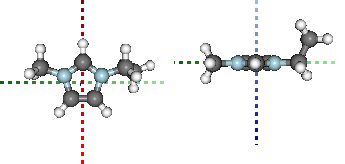

PyGauss
=======

A layer on top of chemlab for analysis of gaussian DFT output

The basic function of the API is to take in data files ouput from
Gaussian for a particular system and analyse their outcome in terms of:
- Geometry alignment, and - Electronic distribution

.. code:: python

    import pygauss.analysis as pg
    folder = pg.get_test_folder()
    
    analysis = pg.Analysis(folder)
    analysis.add_run({'Cation':'emim'},
                    init_fname='CJS1_emim_-_init.com', 
                    opt_fname='CJS1_emim_-_6-311+g-d-p-_gd3bj_opt_.log',
                    freq_fname='CJS1_emim_-_6-311+g-d-p-_gd3bj_freq_.log',
                    nbo_fname='CJS1_emim_-_6-311+g-d-p-_gd3bj_pop-nbo-full-_.log')
    analysis.add_basic_properties()
    analysis.get_table()

.. raw:: html

    

    <table border="1" class="dataframe">
      <thead>
        <tr style="text-align: right;">
          <th></th>
          <th>Cation</th>
          <th>Basis</th>
          <th>Nbasis</th>
          <th>Optimised</th>
          <th>Conformer</th>
        </tr>
      </thead>
      <tbody>
        <tr>
          <th>0</th>
          <td> emim</td>
          <td> 6-311+G(d,p) (5D, 7F)</td>
          <td> 242</td>
          <td> True</td>
          <td> True</td>
        </tr>
      </tbody>
    </table>
    

.. code:: python

    from IPython.display import display
    mols = analysis.yield_mol_images(mtype='optimised',
                                    align_to=[3,2,1], 
                                    rotations=[[0, 0, 90], [-90, 90, 0]],
                                    axis_length=0.5)
    for mol in mols: display(mol)

