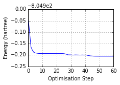
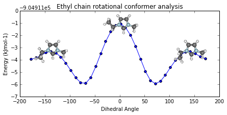
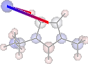
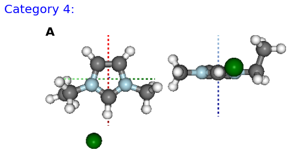

Example Assessment
------------------

You should be able to open an `IPython
Notebook <http://ipython.org/notebook.html>`__ and perform the 
the following:

.. code:: python

    from IPython.display import display
    %matplotlib inline
    import pygauss as pg
    print 'pygauss version: {}'.format(pg.__version__)

.. parsed-literal::

    pygauss version: 0.4.0

and access the test folder with a number of example Gaussian outputs.

.. code:: python

    folder = pg.get_test_folder()
    len(folder.list_files())

.. parsed-literal::

    33

**Note:** the *folder* object will act identical whether using a local
path or one on a server over ssh (using
`paramiko <http://www.paramiko.org/>`__):

::

    folder = pg.Folder('/path/to/folder', 
                    ssh_server='login.server.com',
                    ssh_username='username')

Single Molecule Analysis
~~~~~~~~~~~~~~~~~~~~~~~~

A *molecule* can be created containg data about the inital geometry,
optimisation process and analysis of the final configuration. Molecules
can be viewed statically or interactively (not currently supported by
Firefox).

.. code:: python

    mol = pg.molecule.Molecule(folder_obj=folder,
                    init_fname='CJS1_emim-cl_B_init.com', 
                    opt_fname=['CJS1_emim-cl_B_6-311+g-d-p-_gd3bj_opt-modredundant_difrz.log',
                               'CJS1_emim-cl_B_6-311+g-d-p-_gd3bj_opt-modredundant_difrz_err.log',
                               'CJS1_emim-cl_B_6-311+g-d-p-_gd3bj_opt-modredundant_unfrz.log'],
                    freq_fname='CJS1_emim-cl_B_6-311+g-d-p-_gd3bj_freq_unfrz.log',
                    nbo_fname='CJS1_emim-cl_B_6-311+g-d-p-_gd3bj_pop-nbo-full-_unfrz.log', 
                    atom_groups={'emim':range(20), 'cl':[20]},
                    alignto=[3,2,1])
    
    #mol.show_initial(active=True)
    display(mol.show_initial(represent='vdw', rotations=[[0,0,90], [-90, 90, 0]]))
    display(mol.show_optimisation(represent='ball_stick', rotations=[[0,0,90], [-90, 90, 0]]))

.. image:: images/output_11_0.png

.. image:: images/output_11_1.png

Basic analysis of optimisation...

.. code:: python

    print('Optimised? {0}, Conformer? {1}, Energy = {2} a.u.'.format(
        mol.is_optimised(), mol.is_conformer(), 
        round(mol.get_optimisation_E(units='hartree'),3)))
    ax = mol.plot_optimisation_E(units='hartree')
    ax.get_figure().set_size_inches(3, 2)
    ax = mol.plot_freq_analysis()
    ax.get_figure().set_size_inches(4, 2)

.. parsed-literal::

    Optimised? True, Conformer? True, Energy = -805.105 a.u.

Geometric analysis...

.. code:: python

    print 'Cl optimised polar coords from aromatic ring : ({0}, {1},{2})'.format(
        *[round(i, 2) for i in mol.calc_polar_coords_from_plane(20,3,2,1)])
    ax = mol.plot_opt_trajectory(20, [3,2,1])
    ax.set_title('Cl optimisation path')
    ax.get_figure().set_size_inches(4, 3)

.. parsed-literal::

    Cl optimised polar coords from aromatic ring : (0.11, -116.42,-170.06)

.. image:: images/output_15_1.png

Potential Energy Scan analysis of geometric conformers...

.. code:: python

    mol2 = pg.molecule.Molecule(folder_obj=folder, alignto=[3,2,1],
                pes_fname=['CJS_emim_6311_plus_d3_scan.log', 
                           'CJS_emim_6311_plus_d3_scan_bck.log'])   
    ax = mol2.plot_pes_scans([1,4,9,10], rotation=[0,0,90], img_pos='local_maxs', zoom=0.5)
    ax.set_title('Ethyl chain rotational conformer analysis')
    ax.get_figure().set_size_inches(7, 3)

Natural Bond Orbital and Second Order Perturbation Theory analysis...

.. code:: python

    print '+ve charge centre polar coords from aromatic ring: ({0} {1},{2})'.format(
        *[round(i, 2) for i in mol.calc_nbo_charge_center(3, 2, 1)])
    display(mol.show_nbo_charges(represent='ball_stick', axis_length=0.4, 
                                  rotations=[[0,0,90], [-90, 90, 0]]))

.. parsed-literal::

    +ve charge centre polar coords from aromatic ring: (0.02 -51.77,-33.15)

.. image:: images/output_19_1.png

.. code:: python

    print 'H inter-bond energy = {} kJmol-1'.format(
            mol.calc_hbond_energy(eunits='kJmol-1', atom_groups=['emim', 'cl']))
    print 'Other inter-bond energy = {} kJmol-1'.format(
        mol.calc_sopt_energy(eunits='kJmol-1', no_hbonds=True, atom_groups=['emim', 'cl']))
    display(mol.show_sopt_bonds(min_energy=1, eunits='kJmol-1',
                                atom_groups=['emim', 'cl'],
                                no_hbonds=True,
                                rotations=[[0, 0, 90]]))
    display(mol.show_hbond_analysis(cutoff_energy=5.,alpha=0.6, 
                                    atom_groups=['emim', 'cl'],
                                    rotations=[[0, 0, 90], [90, 0, 0]]))

.. parsed-literal::

    H inter-bond energy = 111.7128 kJmol-1
    Other inter-bond energy = 11.00392 kJmol-1

.. image:: images/output_20_2.png

Multiple Computations Analysis
~~~~~~~~~~~~~~~~~~~~~~~~~~~~~~

Multiple computations, for instance of different starting conformations,
can be grouped into an *Analysis* class.

.. code:: python

    analysis = pg.Analysis(folder_obj=folder)
    errors = analysis.add_runs(headers=['Cation', 'Anion', 'Initial'], 
                                   values=[['emim'], ['cl'],
                                           ['B', 'BE', 'BM', 'F', 'FE']],
                init_pattern='*{0}-{1}_{2}_init.com',
                opt_pattern='*{0}-{1}_{2}_6-311+g-d-p-_gd3bj_opt*unfrz.log',
                freq_pattern='*{0}-{1}_{2}_6-311+g-d-p-_gd3bj_freq*.log',
                nbo_pattern='*{0}-{1}_{2}_6-311+g-d-p-_gd3bj_pop-nbo-full-*.log',
                alignto=[3,2,1], atom_groups={'emim':range(20), 'cl':[20]})
    
    fig, caption = analysis.plot_mol_images(mtype='initial', max_cols=3,
                            info_columns=['Cation', 'Anion', 'Initial'],
                            rotations=[[0,0,90]])
    print caption

.. parsed-literal::

    Figure: (A) emim, cl, B, (B) emim, cl, BE, (C) emim, cl, BM, (D) emim, cl, F, (E) emim, cl, FE

The methods mentioned for indivdiual molecules can then be applied to
all or a subset of these computations.

.. code:: python

    analysis.add_mol_property_subset('Opt', 'is_optimised', rows=[2,3])
    analysis.add_mol_property('Energy (au)', 'get_optimisation_E', units='hartree')
    analysis.add_mol_property('Cation chain, $\\psi$', 'calc_dihedral_angle', [1, 4, 9, 10])
    analysis.add_mol_property('Cation Charge', 'calc_nbo_charge', 'emim')
    analysis.add_mol_property('Anion Charge', 'calc_nbo_charge', 'cl')
    analysis.add_mol_property(['Anion-Cation, $r$', 'Anion-Cation, $\\theta$', 'Anion-Cation, $\\phi$'], 
                                   'calc_polar_coords_from_plane', 3, 2, 1, 20)
    analysis.add_mol_property('Anion-Cation h-bond', 'calc_hbond_energy', 
                              eunits='kJmol-1', atom_groups=['emim', 'cl'])
    tbl = analysis.get_table(row_index=['Anion', 'Cation', 'Initial'], 
                       column_index=['Cation', 'Anion', 'Anion-Cation'])

**NEW FEATURE:** there is now an option (requiring
`pdflatex <http://www.tug.org/applications/pdftex/>`__ and
`ghostscript <http://www.ghostscript.com/download/gsdnld.html>`__\ +\ `imagemagik <http://www.imagemagick.org/script/binary-releases.php>`__)
to output the tables as a latex formatted image.

.. code:: python

    analysis.get_table(row_index=['Anion', 'Cation', 'Initial'],
                       column_index=['Cation', 'Anion', 'Anion-Cation'],
                       as_image=True, font_size=12)

.. image:: images/output_27_0.png

RadViz is a way of visualizing multi-variate data.

.. code:: python

    ax = analysis.plot_radviz_comparison('Anion', columns=range(4, 10))

.. image:: images/output_29_0.png

The KMeans algorithm clusters data by trying to separate samples into n
groups of equal variance.

.. code:: python

    pg.utils.imgplot_kmean_groups(
        analysis, 'Anion', 'cl', 4, range(4, 10), 
        output=['Initial'], mtype='optimised', 
        rotations=[[0, 0, 90], [-90, 90, 0]],
        axis_length=0.3)

.. parsed-literal::

    Figure: (A) B, (B) BE

.. image:: images/output_31_2.png

.. parsed-literal::

    Figure: (A) BM

.. image:: images/output_31_4.png

.. parsed-literal::

    Figure: (A) FE

.. parsed-literal::

    Figure: (A) F

MORE TO COME!!
