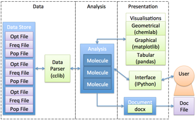

System Description
-------------------

PyGauss has been created as a computational tool for visual and data driven analysis of output from DFT
computations. The package was created to fill a perceived gap in current analytical programme capabilities,
whereby they are closed, Graphical User Interface (GUI) systems that do not allow for autonomous
reproducibility or extensibility of analyses. For example, to compare multiple molecular conformers a user
must open each data file separately, and then record and analyse the relevant data in an external programme.

*PyGauss system diagram (blue=internal class, green=external dependency).*

The figure above illustrates the systems model of PyGauss. It was designed in an object-orientated manner to
have modularity, with well-defined and open interfaces, between the data parsing, analysis and presentation
sub-systems. This allows the system to be flexible to different formats of required input and output data.
Each molecular system is abstracted as a separate entity, with the Molecule class containing computational
methods for analysing these individual systems. The Analysis class then contains methods for comparison of
multiple Molecule systems. The Molecule/Analysis class interface with external sub-systems to format the data
as required and present it to the user.

The system was realised with the Python programming language, which is widely used in the scientific community
and has a number of existing, well-developed scientific packages. The cclib package has been utilised as a data
parser,[1] initially this has focussed on parsing files output from the Gaussian programme (e.g. optimisation,
frequency and population computations) but is extensible to many other DFT programmes. The Numpy package is
used to carry out statistical computations,[2] whilst the Pandas, Matplotlib and chemlab packages are
interfaced with to provide visualisation of the data.[3-5] Finally the IPython package can be used to provide
the user with an interactive interface to the system from where they can create extensible and reusable
analysis.[6]

The source code is housed in an open-source repository. The
code was written in a test-driven development manner, whereby each computational function is written to pass a
number of small defined tests, for example to return a pre-calculated output value for a set of given inputs.
The unit tests are automatically run each time code is added to the repository, reasonably ensuring the system
is always validated to compute the correct outputs.

Automating the analysis in this manner can allow for additional information to be gained from the data, within
the time restrictions of a project. For instance, analysis of the SOPT stabilisation energies to
identify covalent aspects of H-bonding is not available in existing programmes.

1. G. Lanaro. cclib documentation, http://cclib.github.io/
2. S. van der Walt, S. C. Colbert and G. Varoquaux, Computing in Science Engineering, 2011, 13, 22-30, http://dx.doi.org/10.1109/MCSE.2011.37
3. W. McKinney, Data Structures for Statistical Computing in Python, 2010, http://conference.scipy.org/proceedings/scipy2010/mckinney.html
4. J. Hunter, Computing In Science & Engineering, 2007, 9, 90-95, http://dx.doi.org/10.5281/zenodo.15423.
5. G. Lanaro. chemlab documentation, http://chemlab.readthedocs.org
6. F. Pérez and B. E. Granger, Computing in Science Engineering, 2007, 9, 21-29, http://dx.doi.org/10.1109/MCSE.2007.53

